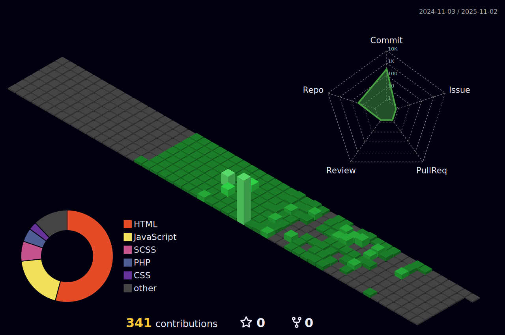

<!-- 🌊 헤더 -->

<!-- ⌨️ 타이핑 애니메이션 -->
<h1>
  
</h1>

<!-- github status -->

  
  

---

<!-- 📈 GitHub 활동 그래프 -->

## 🚀 MY TECH STACKS · 기술 스택 소개

> 아래는 제가 사용하는 주요 기술들을 영역별로 나누어 정리한 목록입니다.

---

### 🎨 • FRONT-END

### 🛠 • BACK-END

### 🧪 • ETC

---

<!-- 🧩 3D 기여 그래프 -->

---

<!-- 🌊 푸터 -->

<!--
**chmsk3321/chmsk3321** is a ✨ _special_ ✨ repository because its `README.md` (this file) appears on your GitHub profile.

Here are some ideas to get you started:

- 🔭 I’m currently working on ...
- 🌱 I’m currently learning ...
- 👯 I’m looking to collaborate on ...
- 🤔 I’m looking for help with ...
- 💬 Ask me about ...
- 📫 How to reach me: ...
- 😄 Pronouns: ...
- ⚡ Fun fact: ...
-->
